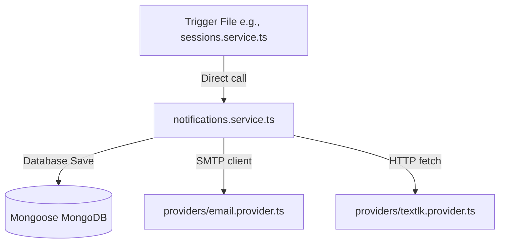

# Notification System Documentation for Grow Fitness 2.0

This document provides a comprehensive technical overview and reference manual for the notification system implemented in the Grow Fitness 2.0 backend.

---

## 1. System Overview

The Grow Fitness 2.0 notification system is built on **Nest.js**, **TypeScript**, and **Mongoose/MongoDB**. It handles communication with parent users, coaches, and system administrators.

### Core Architecture
* **Channels Supported**:
  1. **In-App Notifications**: Persistent records stored in MongoDB and managed via a REST API.
  2. **Email**: HTML and plain text emails sent via `nodemailer`.
  3. **SMS**: Text messages delivered via the Text.lk HTTP API (primarily targeting Sri Lankan phone numbers).
  4. **PDF Invoicing**: Invoices rendered dynamically from HTML templates and printed to PDF via Puppeteer (Chromium), then attached to outbound emails.
* **Execution Model**: **Direct Calls** (Synchronous & Async). The system is not event-driven (no event emitters or message queues). Instead, business logic services directly inject [NotificationService](file:///Users/wandanamaddumage/Developer/growfitness-2.0/apps/api/src/modules/notifications/notifications.service.ts) and call its methods during request/response execution cycles or inside scheduled cron jobs.
* **Configurable Mock Modes**: Both the email and SMS providers support a "Mock Mode." If email or SMS is disabled or incomplete in configuration, notifications are safely redirected to the Nest.js application console logger rather than throwing exceptions or halting execution.

---

## 2. File Structure & Responsibilities

The notification logic is structured across these files and directories:

### Notification Core
* **Service Class**: [notifications.service.ts](file:///Users/wandanamaddumage/Developer/growfitness-2.0/apps/api/src/modules/notifications/notifications.service.ts)
  * *Responsibility*: Contains message templates (email bodies, SMS content), channel dispatch orchestration, and CRUD logic for in-app notifications.
* **Controller**: [notifications.controller.ts](file:///Users/wandanamaddumage/Developer/growfitness-2.0/apps/api/src/modules/notifications/notifications.controller.ts)
  * *Responsibility*: Exposes REST API endpoints for in-app notifications (fetching paginated items, getting unread counts, marking as read, deleting).
* **Module Definition**: [notifications.module.ts](file:///Users/wandanamaddumage/Developer/growfitness-2.0/apps/api/src/modules/notifications/notifications.module.ts)
  * *Responsibility*: Ties the controller, service, database schemas, and channel providers together.
* **Database Schema**: [notification.schema.ts](file:///Users/wandanamaddumage/Developer/growfitness-2.0/apps/api/src/infra/database/schemas/notification.schema.ts)
  * *Responsibility*: Defines the MongoDB schema for persistent in-app notifications (fields for title, body, status, entity links, etc.).

### Channel Providers
* **Email Provider**: [email.provider.ts](file:///Users/wandanamaddumage/Developer/growfitness-2.0/apps/api/src/modules/notifications/providers/email.provider.ts)
  * *Responsibility*: Wraps NodeMailer, manages SMTP client initialization, handles PDF attachments, and implements the console mock mode fallback.
* **SMS Provider**: [textlk.provider.ts](file:///Users/wandanamaddumage/Developer/growfitness-2.0/apps/api/src/modules/notifications/providers/textlk.provider.ts)
  * *Responsibility*: Formats phone numbers, calls the Text.lk API using `fetch`, and implements the console mock mode fallback.
* **Phone Utility**: [phone.util.ts](file:///Users/wandanamaddumage/Developer/growfitness-2.0/apps/api/src/modules/notifications/providers/phone.util.ts)
  * *Responsibility*: Normalizes phone numbers to standard E.164 format (e.g., converts local Sri Lankan `07...` to `+947...`).

### Key Supporting Services
* **PDF Invoicing**: [invoice-pdf.service.ts](file:///Users/wandanamaddumage/Developer/growfitness-2.0/apps/api/src/modules/invoices/invoice-pdf.service.ts)
  * *Responsibility*: Pulls invoice data, loads `@grow-fitness/invoice-print` template modules, launches Puppeteer to print the invoice to a PDF Buffer, calls `sendInvoicePdfEmail`, and triggers post-send notifications.
* **Cron Scheduling**: [reminders.service.ts](file:///Users/wandanamaddumage/Developer/growfitness-2.0/apps/api/src/modules/reminders/reminders.service.ts)
  * *Responsibility*: Declares cron jobs using Nest.js `@nestjs/schedule` to run recurring reminders (daily upcoming sessions, invoice payment alerts, month-end dues).

---

## 3. Notification Scenarios & Details

Here is the detailed catalog of every notification scenario currently implemented:

### Scenario 1: User Registration Request (Public Sign Up)
* **Trigger Event**: [users.service.ts](file:///Users/wandanamaddumage/Developer/growfitness-2.0/apps/api/src/modules/users/users.service.ts) → `createParent()` (when `actorId` is null, indicating a public registration)
* **Notification Type**: In-App
* **Recipient(s)**: All Administrators (`UserRole.ADMIN`)
* **Message Content**:
  * **Title**: `New user registration request`
  * **Body**: `{{parentName}} has requested to join.` *(where parentName is parent.parentProfile.name or parent.email)*
  * **Entity Info**: `entityType: 'UserRegistrationRequest'`, `entityId: {{requestId}}`
* **Timing**: Immediate (Synchronous)

### Scenario 2: User Registration Approved
* **Trigger Event**: [requests.service.ts](file:///Users/wandanamaddumage/Developer/growfitness-2.0/apps/api/src/modules/requests/requests.service.ts) → `approveUserRegistrationRequest()`
* **Notification Type**: In-App, Email, SMS
* **Recipient(s)**: The Parent who signed up
* **Message Content**:
  * **In-App**:
    * **Title**: `Registration approved`
    * **Body**: `Your account has been approved. You can now sign in.`
    * **Entity Info**: `entityType: 'UserRegistrationRequest'`, `entityId: {{id}}`
  * **Email & SMS**:
    * **Subject**: `Account Approved`
    * **Body / Message**: `Hello {{parentName}}, your Grow Fitness account has been approved. You can now sign in.` *(where parentName defaults to 'there' if undefined)*
* **Timing**: Immediate (Synchronous)

### Scenario 3: User Registration Rejected
* **Trigger Event**: [requests.service.ts](file:///Users/wandanamaddumage/Developer/growfitness-2.0/apps/api/src/modules/requests/requests.service.ts) → `rejectUserRegistrationRequest()`
* **Notification Type**: In-App
* **Recipient(s)**: The Parent who signed up
* **Message Content**:
  * **Title**: `Registration not approved`
  * **Body**: `Your account registration was not approved. Please contact support if you have questions.`
  * **Entity Info**: `entityType: 'UserRegistrationRequest'`, `entityId: {{id}}`
* **Timing**: Immediate (Synchronous)

### Scenario 4: Password Reset Request
* **Trigger Event**: [auth.service.ts](file:///Users/wandanamaddumage/Developer/growfitness-2.0/apps/api/src/modules/auth/auth.service.ts) → `requestPasswordReset()` → calls [notifications.service.ts](file:///Users/wandanamaddumage/Developer/growfitness-2.0/apps/api/src/modules/notifications/notifications.service.ts) → `sendPasswordResetEmail()`
* **Notification Type**: Email
* **Recipient(s)**: The User requesting the reset (Parent or Coach)
* **Message Content**:
  * **Subject**: `Reset Your Password`
  * **Body**:
    ```text
    Hello {{userName}},

    You requested to reset your password for your Grow Fitness account.

    Click the link below to reset your password:
    {{resetUrl}}

    This link will expire in {{expiryHours}} hours.

    If you did not request this password reset, please ignore this email. Your password will remain unchanged.

    For security reasons, please do not share this link with anyone.

    Best regards,
    Grow Fitness Team
    ```
* **Timing**: Immediate (Synchronous, but errors caught gracefully)

### Scenario 5: Profile Updated (Self-Service)
* **Trigger Event**: [users.service.ts](file:///Users/wandanamaddumage/Developer/growfitness-2.0/apps/api/src/modules/users/users.service.ts) → `updateParentSelf()`
* **Notification Type**: In-App
* **Recipient(s)**: The Parent user
* **Message Content**:
  * **Title**: `Profile updated`
  * **Body**: `Your profile information was saved.`
* **Timing**: Immediate (Synchronous)

### Scenario 6: Profile Updated (By Admin)
* **Trigger Event**: [users.service.ts](file:///Users/wandanamaddumage/Developer/growfitness-2.0/apps/api/src/modules/users/users.service.ts) → `updateParent()` (when change is detected)
* **Notification Type**: In-App
* **Recipient(s)**: The Parent user
* **Message Content**:
  * **Title**: `Profile updated`
  * **Body**: `An administrator updated your profile information.`
  * **Entity Info**: `entityType: 'User'`, `entityId: {{id}}`
* **Timing**: Immediate (Synchronous)

### Scenario 7: Coach Account Created (By Admin)
* **Trigger Event**: [users.service.ts](file:///Users/wandanamaddumage/Developer/growfitness-2.0/apps/api/src/modules/users/users.service.ts) → `createCoach()` → calls [notifications.service.ts](file:///Users/wandanamaddumage/Developer/growfitness-2.0/apps/api/src/modules/notifications/notifications.service.ts) → `sendCoachAccountCreated()`
* **Notification Type**: Email, SMS
* **Recipient(s)**: The Coach
* **Message Content**:
  * **Email**:
    * **Subject**: `Your Grow Fitness coach account`
    * **Body**:
      ```text
      Hello {{coachName}},

      Your Grow Fitness coach account has been created. You can sign in at:
      {{loginUrl}}

      Use your email address and the password your administrator shared with you. If you need to reset your password, use "Forgot password" on the login page.

      Best regards,
      Grow Fitness Team
      ```
  * **SMS**:
    * **Message**: `Hi {{coachName}}, your Grow Fitness coach account is ready. Sign in: {{loginUrl}} — use your email and the password from your administrator.`
* **Timing**: Immediate (Asynchronous, errors logged in background)

### Scenario 8: Free Session Request Submitted
* **Trigger Event**: [requests.service.ts](file:///Users/wandanamaddumage/Developer/growfitness-2.0/apps/api/src/modules/requests/requests.service.ts) → `createFreeSessionRequest()`
* **Notification Type**: In-App
* **Recipient(s)**: All Administrators (`UserRole.ADMIN`)
* **Message Content**:
  * **Title**: `New free session request`
  * **Body**: `{{parentName}} requested a free session for {{kidName}}.`
  * **Entity Info**: `entityType: 'FreeSessionRequest'`, `entityId: {{id}}`
* **Timing**: Immediate (Synchronous)

### Scenario 9: Free Session Request Selected & Confirmed
* **Trigger Event**: [requests.service.ts](file:///Users/wandanamaddumage/Developer/growfitness-2.0/apps/api/src/modules/requests/requests.service.ts) → `selectFreeSessionRequest()`
* **Notification Type**: In-App, Email, SMS
* **Recipient(s)**: The Parent
* **Message Content**:
  * **In-App** *(if parent has an existing account)*:
    * **Title**: `Free session confirmed`
    * **Body**: `Your free session request for {{kidName}} has been confirmed.`
    * **Entity Info**: `entityType: 'FreeSessionRequest'`, `entityId: {{id}}`
  * **Email & SMS**:
    * **Subject**: `Free Session Confirmation`
    * **Body / Message**: `Hello {{parentName}}, your free session request for {{kidName}} has been confirmed!`
* **Timing**: Immediate (Synchronous)

### Scenario 10: Session Reschedule Requested
* **Trigger Event**: [requests.service.ts](file:///Users/wandanamaddumage/Developer/growfitness-2.0/apps/api/src/modules/requests/requests.service.ts) → `createRescheduleRequest()`
* **Notification Type**: In-App
* **Recipient(s)**: All Administrators (`UserRole.ADMIN`)
* **Message Content**:
  * **Title**: `New reschedule request`
  * **Body**: `A session reschedule has been requested.`
  * **Entity Info**: `entityType: 'RescheduleRequest'`, `entityId: {{id}}`
* **Timing**: Immediate (Synchronous)

### Scenario 11: Reschedule Request Approved
* **Trigger Event**: [requests.service.ts](file:///Users/wandanamaddumage/Developer/growfitness-2.0/apps/api/src/modules/requests/requests.service.ts) → `approveRescheduleRequest()`
* **Notification Type**: In-App
* **Recipient(s)**: The Requester (Parent or Coach)
* **Message Content**:
  * **Title**: `Reschedule approved`
  * **Body**: `Your session reschedule request has been approved.`
  * **Entity Info**: `entityType: 'RescheduleRequest'`, `entityId: {{id}}`
* **Timing**: Immediate (Synchronous). *Note: approving this schedules the new date/time which also triggers a separate Session Updated notification.*

### Scenario 12: Reschedule Request Denied
* **Trigger Event**: [requests.service.ts](file:///Users/wandanamaddumage/Developer/growfitness-2.0/apps/api/src/modules/requests/requests.service.ts) → `denyRescheduleRequest()`
* **Notification Type**: In-App
* **Recipient(s)**: The Requester (Parent or Coach)
* **Message Content**:
  * **Title**: `Reschedule denied`
  * **Body**: `Your session reschedule request has been denied.`
  * **Entity Info**: `entityType: 'RescheduleRequest'`, `entityId: {{id}}`
* **Timing**: Immediate (Synchronous)

### Scenario 13: Extra Session Requested
* **Trigger Event**: [requests.service.ts](file:///Users/wandanamaddumage/Developer/growfitness-2.0/apps/api/src/modules/requests/requests.service.ts) → `createExtraSessionRequest()`
* **Notification Type**: In-App
* **Recipient(s)**: All Administrators (`UserRole.ADMIN`)
* **Message Content**:
  * **Title**: `New extra session request`
  * **Body**: `An extra session has been requested.`
  * **Entity Info**: `entityType: 'ExtraSessionRequest'`, `entityId: {{id}}`
* **Timing**: Immediate (Synchronous)

### Scenario 14: Extra Session Request Approved
* **Trigger Event**: [requests.service.ts](file:///Users/wandanamaddumage/Developer/growfitness-2.0/apps/api/src/modules/requests/requests.service.ts) → `approveExtraSessionRequest()`
* **Notification Type**: In-App
* **Recipient(s)**: The Parent
* **Message Content**:
  * **Title**: `Extra session approved`
  * **Body**: `Your extra session request has been approved.`
  * **Entity Info**: `entityType: 'ExtraSessionRequest'`, `entityId: {{id}}`
* **Timing**: Immediate (Synchronous). *Note: approving this creates the session which triggers a Session Scheduled notification.*

### Scenario 15: Extra Session Request Denied
* **Trigger Event**: [requests.service.ts](file:///Users/wandanamaddumage/Developer/growfitness-2.0/apps/api/src/modules/requests/requests.service.ts) → `denyExtraSessionRequest()`
* **Notification Type**: In-App
* **Recipient(s)**: The Parent
* **Message Content**:
  * **Title**: `Extra session denied`
  * **Body**: `Your extra session request has been denied.`
  * **Entity Info**: `entityType: 'ExtraSessionRequest'`, `entityId: {{id}}`
* **Timing**: Immediate (Synchronous)

### Scenario 16: Session Scheduled (Single)
* **Trigger Event**: [sessions.service.ts](file:///Users/wandanamaddumage/Developer/growfitness-2.0/apps/api/src/modules/sessions/sessions.service.ts) → `create()`
* **Notification Type**: In-App
* **Recipient(s)**: Assigned Coach + Parents of all enrolled kids
* **Message Content**:
  * **Title**: `New session scheduled`
  * **Body**: `Session "{{session.title}}" has been scheduled.`
  * **Entity Info**: `entityType: 'Session'`, `entityId: {{sessionId}}`
* **Timing**: Immediate (Synchronous)

### Scenario 17: Session Scheduled (Recurring Group)
* **Trigger Event**: [sessions.service.ts](file:///Users/wandanamaddumage/Developer/growfitness-2.0/apps/api/src/modules/sessions/sessions.service.ts) → `createRecurring()`
* **Notification Type**: In-App
* **Recipient(s)**: Assigned Coach + Parents of all enrolled kids
* **Message Content**:
  * **Title**: `Recurring sessions scheduled`
  * **Body**: `{{createdCount}} recurring sessions for "{{session.title}}" were scheduled.`
  * **Entity Info**: `entityType: 'SessionRecurringGroup'`, `entityId: {{recurringGroupId}}`
* **Timing**: Immediate (Synchronous)

### Scenario 18: Session Updated
* **Trigger Event**: [sessions.service.ts](file:///Users/wandanamaddumage/Developer/growfitness-2.0/apps/api/src/modules/sessions/sessions.service.ts) → `update()` (triggered when `statusChanged` or `dateTimeChanged` resolves to true)
* **Notification Type**: In-App, Email, SMS
* **Recipient(s)**: Assigned Coach + Parents of all enrolled kids
* **Message Content**:
  * **In-App**:
    * **Title**: `Session updated`
    * **Body**: `Session "{{session.title}}": {{changesStr}}` *(where changesStr list changes, e.g., 'status: SCHEDULED → CANCELLED' or 'date/time updated')*
    * **Notification Type**: dynamically selected based on status (`SESSION_CANCELLED` if status is cancelled, `SESSION_COMPLETED` if status is completed, or `SESSION_UPDATED` for edits)
    * **Entity Info**: `entityType: 'Session'`, `entityId: {{id}}`
  * **Email & SMS**:
    * **Subject**: `Session Update`
    * **Body / Message**: `Your session has been updated: {{changes}}` *(where changes is changesStr)*
* **Timing**: Immediate (Synchronous)

### Scenario 19: Session Deleted
* **Trigger Event**: [sessions.service.ts](file:///Users/wandanamaddumage/Developer/growfitness-2.0/apps/api/src/modules/sessions/sessions.service.ts) → `delete()`
* **Notification Type**: In-App
* **Recipient(s)**: Assigned Coach + Parents of all enrolled kids
* **Message Content**:
  * **Title**: `Session deleted`
  * **Body**: `Session "{{session.title}}" has been deleted.`
  * **Entity Info**: `entityType: 'Session'`, `entityId: {{id}}`
* **Timing**: Immediate (Synchronous)

### Scenario 20: Invoice Delivered (First Send)
* **Trigger Event**: [invoice-pdf.service.ts](file:///Users/wandanamaddumage/Developer/growfitness-2.0/apps/api/src/modules/invoices/invoice-pdf.service.ts) → `sendInvoicePdfByEmail()` (when `invoice.pdfEmailedAt` is null and first email goes out)
* **Notification Type**: In-App, Email (PDF Attachment), SMS (for Parent)
* **Recipient(s)**: Parent (if `PARENT_INVOICE`) or Coach (if `COACH_PAYOUT`)
* **Message Content**:
  * **Direct Email (PDF Attachment)**:
    * **Subject**: `Your Grow Fitness invoice`
    * **Body**: `Hello {{recipientName}}, please find your Grow Fitness invoice attached as a PDF.` *(attaches file: 'invoice-{{id}}.pdf')*
  * **Outbound Parent Channels (If Parent Invoice)**:
    * **In-App**:
      * **Title**: `New invoice`
      * **Body**: `A new invoice has been issued for you. Please log in to view and pay.`
      * **Entity Info**: `entityType: 'Invoice'`, `entityId: {{id}}`
    * **Email & SMS Alert**:
      * **Subject**: `New Invoice`
      * **Body / Message**: `Hello {{recipientName}}, you have a new invoice from Grow Fitness. Please log in to view and pay.`
  * **Outbound Coach Channels (If Coach Payout)**:
    * **In-App**:
      * **Title**: `New payout invoice`
      * **Body**: `A new payout invoice has been created for you.`
      * **Entity Info**: `entityType: 'Invoice'`, `entityId: {{id}}`
* **Timing**: Immediate on Admin dispatch. (Synchronous)

### Scenario 21: Invoice Payment Status Updated
* **Trigger Event**: [invoices.service.ts](file:///Users/wandanamaddumage/Developer/growfitness-2.0/apps/api/src/modules/invoices/invoices.service.ts) → `updatePaymentStatus()` (only triggers notifications if the invoice has been previously sent via PDF)
* **Notification Type**: In-App, Email, SMS
* **Recipient(s)**: Parent (if `PARENT_INVOICE`) or Coach (if `COACH_PAYOUT`)
* **Message Content**:
  * **Parent Invoice**:
    * **In-App**:
      * **Title**: `Invoice updated`
      * **Body**: `Your invoice status has been updated to: {{status}}.`
      * **Entity Info**: `entityType: 'Invoice'`, `entityId: {{id}}`
    * **Email & SMS**:
      * **Subject**: `Invoice Update`
      * **Body / Message**: `Your invoice status has been updated to: {{status}}`
  * **Coach Payout**:
    * **In-App**:
      * **Title**: `Payout invoice updated`
      * **Body**: `Your payout has been marked as paid.` (or `Your payout invoice status has been updated to: {{status}}.` if status is not paid)
      * **Entity Info**: `entityType: 'Invoice'`, `entityId: {{id}}`
    * **Email & SMS Alert** *(Only if status updated to `PAID`)*:
      * **Subject**: `Payment Processed`
      * **Body / Message**: `Hello {{coachName}}, your monthly payment has been processed.`
* **Timing**: Immediate (Synchronous)

### Scenario 22: Invoice Creation Reminder (Admins)
* **Trigger Event**: [reminders.service.ts](file:///Users/wandanamaddumage/Developer/growfitness-2.0/apps/api/src/modules/reminders/reminders.service.ts) → `remindAdminsToCreateInvoices()`
* **Notification Type**: In-App
* **Recipient(s)**: All Administrators (`UserRole.ADMIN`)
* **Message Content**:
  * **Title**: `Reminder: Create and send invoices`
  * **Body**: `You have {{completedCount}} completed session(s) in the past 7 days. Remember to create and send invoices.`
  * **Entity Info**: `entityType: 'Session'`
* **Timing**: Scheduled Daily at 9:00 AM (Cron: `0 9 * * *`) (Asynchronous)

### Scenario 23: Invoice Payment Reminder (Parents)
* **Trigger Event**: [reminders.service.ts](file:///Users/wandanamaddumage/Developer/growfitness-2.0/apps/api/src/modules/reminders/reminders.service.ts) → `remindParentsToPayInvoices()`
* **Notification Type**: In-App
* **Recipient(s)**: Parents with PENDING invoices due within 3 days (that were already sent via PDF)
* **Message Content**:
  * **Title**: `Reminder: Pay your invoice`
  * **Body**: `You have an outstanding or soon-due invoice. Please log in to view and pay.`
  * **Entity Info**: `entityType: 'Invoice'`, `entityId: {{invoiceId}}`
* **Timing**: Scheduled Daily at 10:00 AM (Cron: `0 10 * * *`) (Asynchronous)

### Scenario 24: Month-End Payment Reminder (Parents)
* **Trigger Event**: [reminders.service.ts](file:///Users/wandanamaddumage/Developer/growfitness-2.0/apps/api/src/modules/reminders/reminders.service.ts) → `sendMonthEndPaymentReminder()`
* **Notification Type**: In-App, Email, SMS
* **Recipient(s)**: Parents with PENDING invoices (that were already sent via PDF)
* **Message Content**:
  * **In-App**:
    * **Title**: `Month-end reminder: Outstanding invoice`
    * **Body**: `Please pay your outstanding invoice before month end.`
    * **Entity Info**: `entityType: 'Invoice'`, `entityId: {{invoiceId}}`
  * **Email & SMS Alert**:
    * **Subject**: `Reminder: Outstanding Invoice`
    * **Body / Message**: `Hello {{recipientName}}, friendly reminder: you have an outstanding invoice from Grow Fitness. Please log in to view and pay before month end.`
* **Timing**: Scheduled Monthly on the 25th at 11:00 AM (Cron: `0 11 25 * *`) (Asynchronous)

### Scenario 25: Upcoming Session Reminder (Parents & Coaches)
* **Trigger Event**: [reminders.service.ts](file:///Users/wandanamaddumage/Developer/growfitness-2.0/apps/api/src/modules/reminders/reminders.service.ts) → `sendUpcomingSessionReminder()`
* **Notification Type**: In-App
* **Recipient(s)**: Coach + Parents of kids enrolled in a session scheduled in the next 24 hours
* **Message Content**:
  * **Title**: `Upcoming session`
  * **Body**: `Reminder: "{{sessionTitle}}" is scheduled within the next 24 hours ({{dateStr}}).`
  * **Entity Info**: `entityType: 'Session'`, `entityId: {{sessionId}}`
* **Timing**: Scheduled Daily at 8:00 AM (Cron: `0 8 * * *`) (Asynchronous)

---

## 4. Code Trace Detail

For each major feature flow, here is the exact trace of file involvement, class methods, and data transmission:



### Flow 1: Password Reset
* **Trigger**: [auth.service.ts](file:///Users/wandanamaddumage/Developer/growfitness-2.0/apps/api/src/modules/auth/auth.service.ts) → `requestPasswordReset(email)`
* **Service**: [notifications.service.ts](file:///Users/wandanamaddumage/Developer/growfitness-2.0/apps/api/src/modules/notifications/notifications.service.ts) → `sendPasswordResetEmail(user, token)`
* **Channel**: [email.provider.ts](file:///Users/wandanamaddumage/Developer/growfitness-2.0/apps/api/src/modules/notifications/providers/email.provider.ts) → `send(data)`
* **Data Flow**:
  1. User enters email on login page. Request hits `auth.controller.ts` -> `forgotPassword`.
  2. Controller delegates to `auth.service.ts` -> `requestPasswordReset`.
  3. `AuthService` queries user database, creates a random token, saves token document with expiry date, and calls `sendPasswordResetEmail(user, token)`.
  4. `NotificationService` formats the URL link and text body, then invokes `emailProvider.send(...)`.
  5. `EmailProvider` prepares Nodemailer options and sends it via SMTP.

### Flow 2: Session Update
* **Trigger**: [sessions.service.ts](file:///Users/wandanamaddumage/Developer/growfitness-2.0/apps/api/src/modules/sessions/sessions.service.ts) → `update(id, updateSessionDto, actorId)`
* **Services**:
  * [notifications.service.ts](file:///Users/wandanamaddumage/Developer/growfitness-2.0/apps/api/src/modules/notifications/notifications.service.ts) → `createNotification()`
  * [notifications.service.ts](file:///Users/wandanamaddumage/Developer/growfitness-2.0/apps/api/src/modules/notifications/notifications.service.ts) → `sendSessionChange()`
* **Channels**:
  * DB (In-app notification collection)
  * [email.provider.ts](file:///Users/wandanamaddumage/Developer/growfitness-2.0/apps/api/src/modules/notifications/providers/email.provider.ts) → `send()`
  * [textlk.provider.ts](file:///Users/wandanamaddumage/Developer/growfitness-2.0/apps/api/src/modules/notifications/providers/textlk.provider.ts) → `send()`
* **Data Flow**:
  1. Admin updates session datetime/status. Request hits `sessions.controller.ts` -> `update`.
  2. `SessionsService` compiles the list of updates, queries parent profiles for all kids in the session, and resolves the coach user profile.
  3. Loops through all parent IDs and coach ID, calling `createNotification()` to write in-app logs.
  4. For the coach and each parent, calls `sendSessionChange()` with email/phone details.
  5. `NotificationService` formats updates, invoking SMTP email sends and Text.lk SMS HTTP requests concurrently via `Promise.all`.

### Flow 3: Invoice Delivery (First Send)
* **Trigger**: [invoice-pdf.service.ts](file:///Users/wandanamaddumage/Developer/growfitness-2.0/apps/api/src/modules/invoices/invoice-pdf.service.ts) → `sendInvoicePdfByEmail(invoiceId, actor)`
* **Services**:
  * [notifications.service.ts](file:///Users/wandanamaddumage/Developer/growfitness-2.0/apps/api/src/modules/notifications/notifications.service.ts) → `sendInvoicePdfEmail()`
  * [invoices.service.ts](file:///Users/wandanamaddumage/Developer/growfitness-2.0/apps/api/src/modules/invoices/invoices.service.ts) → `notifyRecipientsInvoiceDeliveredOnce()`
* **Channels**:
  * Email (with PDF attachment)
  * DB (In-app notification collection)
  * SMS Alert
* **Data Flow**:
  1. Admin clicks "Send invoice" in Admin Portal. Hits `invoices.controller.ts` -> `sendInvoicePdfEmail`.
  2. `InvoicePdfService` verifies recipient email, pulls invoice items, and generates HTML.
  3. Launches Puppeteer instance to convert HTML string to PDF binary buffer.
  4. Calls `sendInvoicePdfEmail()` passing the PDF buffer. `NotificationService` calls `EmailProvider` to send email with the attachment.
  5. If the invoice has never been emailed before, updates database flag and calls `notifyRecipientsInvoiceDeliveredOnce`.
  6. `InvoicesService` emits secondary in-app alerts and email/SMS confirmation alerts to the parent.

---

## 5. Scenario Summary Table

| Scenario | Trigger File | Recipient | Type | Message | Status (Enabled by default) |
|---|---|---|---|---|---|
| User Reg Request | [users.service.ts](file:///Users/wandanamaddumage/Developer/growfitness-2.0/apps/api/src/modules/users/users.service.ts) | Admins | In-App | `{{name}} has requested to join.` | Active |
| Registration Approved | [requests.service.ts](file:///Users/wandanamaddumage/Developer/growfitness-2.0/apps/api/src/modules/requests/requests.service.ts) | Parent | In-App, Email, SMS | `Hello {{name}}, your Grow Fitness account has been approved.` | Active |
| Registration Rejected | [requests.service.ts](file:///Users/wandanamaddumage/Developer/growfitness-2.0/apps/api/src/modules/requests/requests.service.ts) | Parent | In-App | `Your account registration was not approved.` | Active |
| Password Reset Request | [auth.service.ts](file:///Users/wandanamaddumage/Developer/growfitness-2.0/apps/api/src/modules/auth/auth.service.ts) | Requester | Email | `Click the link below to reset your password: {{resetUrl}}` | Active |
| Profile Updated (Self) | [users.service.ts](file:///Users/wandanamaddumage/Developer/growfitness-2.0/apps/api/src/modules/users/users.service.ts) | Parent | In-App | `Your profile information was saved.` | Active |
| Profile Updated (Admin) | [users.service.ts](file:///Users/wandanamaddumage/Developer/growfitness-2.0/apps/api/src/modules/users/users.service.ts) | Parent | In-App | `An administrator updated your profile information.` | Active |
| Coach Account Created | [users.service.ts](file:///Users/wandanamaddumage/Developer/growfitness-2.0/apps/api/src/modules/users/users.service.ts) | Coach | Email, SMS | `Your Grow Fitness coach account has been created. Sign in: {{url}}` | Active |
| Free Session Requested | [requests.service.ts](file:///Users/wandanamaddumage/Developer/growfitness-2.0/apps/api/src/modules/requests/requests.service.ts) | Admins | In-App | `{{name}} requested a free session for {{kidName}}.` | Active |
| Free Session Confirmed | [requests.service.ts](file:///Users/wandanamaddumage/Developer/growfitness-2.0/apps/api/src/modules/requests/requests.service.ts) | Parent | In-App, Email, SMS | `Hello {{name}}, your free session request for {{kidName}} has been confirmed!` | Active |
| Reschedule Requested | [requests.service.ts](file:///Users/wandanamaddumage/Developer/growfitness-2.0/apps/api/src/modules/requests/requests.service.ts) | Admins | In-App | `A session reschedule has been requested.` | Active |
| Reschedule Approved | [requests.service.ts](file:///Users/wandanamaddumage/Developer/growfitness-2.0/apps/api/src/modules/requests/requests.service.ts) | Requester | In-App | `Your session reschedule request has been approved.` | Active |
| Reschedule Denied | [requests.service.ts](file:///Users/wandanamaddumage/Developer/growfitness-2.0/apps/api/src/modules/requests/requests.service.ts) | Requester | In-App | `Your session reschedule request has been denied.` | Active |
| Extra Session Requested | [requests.service.ts](file:///Users/wandanamaddumage/Developer/growfitness-2.0/apps/api/src/modules/requests/requests.service.ts) | Admins | In-App | `An extra session has been requested.` | Active |
| Extra Session Approved | [requests.service.ts](file:///Users/wandanamaddumage/Developer/growfitness-2.0/apps/api/src/modules/requests/requests.service.ts) | Parent | In-App | `Your extra session request has been approved.` | Active |
| Extra Session Denied | [requests.service.ts](file:///Users/wandanamaddumage/Developer/growfitness-2.0/apps/api/src/modules/requests/requests.service.ts) | Parent | In-App | `Your extra session request has been denied.` | Active |
| Session Scheduled (Single) | [sessions.service.ts](file:///Users/wandanamaddumage/Developer/growfitness-2.0/apps/api/src/modules/sessions/sessions.service.ts) | Coach, Parents | In-App | `Session "{{session.title}}" has been scheduled.` | Active |
| Session Scheduled (Recur) | [sessions.service.ts](file:///Users/wandanamaddumage/Developer/growfitness-2.0/apps/api/src/modules/sessions/sessions.service.ts) | Coach, Parents | In-App | `{{count}} recurring sessions for "{{title}}" were scheduled.` | Active |
| Session Updated | [sessions.service.ts](file:///Users/wandanamaddumage/Developer/growfitness-2.0/apps/api/src/modules/sessions/sessions.service.ts) | Coach, Parents | In-App, Email, SMS | `Session "{{title}}": {{changes}}` | Active |
| Session Deleted | [sessions.service.ts](file:///Users/wandanamaddumage/Developer/growfitness-2.0/apps/api/src/modules/sessions/sessions.service.ts) | Coach, Parents | In-App | `Session "{{title}}" has been deleted.` | Active |
| Invoice PDF Delivered | [invoice-pdf.service.ts](file:///Users/wandanamaddumage/Developer/growfitness-2.0/apps/api/src/modules/invoices/invoice-pdf.service.ts) | Recipient | Email | `Please find your Grow Fitness invoice attached as a PDF.` | Active |
| New Invoice (First Send) | [invoices.service.ts](file:///Users/wandanamaddumage/Developer/growfitness-2.0/apps/api/src/modules/invoices/invoices.service.ts) | Parent | In-App, Email, SMS | `Hello {{name}}, you have a new invoice from Grow Fitness.` | Active |
| Invoice Status Updated | [invoices.service.ts](file:///Users/wandanamaddumage/Developer/growfitness-2.0/apps/api/src/modules/invoices/invoices.service.ts) | Parent/Coach | In-App, Email, SMS | `Your invoice status has been updated to: {{status}}.` | Active |
| Payout Processed (PAID) | [invoices.service.ts](file:///Users/wandanamaddumage/Developer/growfitness-2.0/apps/api/src/modules/invoices/invoices.service.ts) | Coach | Email, SMS | `Hello {{coachName}}, your monthly payment has been processed.` | Active |
| Admin Invoice Creation Rem. | [reminders.service.ts](file:///Users/wandanamaddumage/Developer/growfitness-2.0/apps/api/src/modules/reminders/reminders.service.ts) | Admins | In-App | `You have {{count}} completed session(s)... Remember to create/send...` | Active |
| Parent Invoice Reminder | [reminders.service.ts](file:///Users/wandanamaddumage/Developer/growfitness-2.0/apps/api/src/modules/reminders/reminders.service.ts) | Parent | In-App | `You have an outstanding or soon-due invoice.` | Active |
| Month-End Payment Rem. | [reminders.service.ts](file:///Users/wandanamaddumage/Developer/growfitness-2.0/apps/api/src/modules/reminders/reminders.service.ts) | Parent | In-App, Email, SMS | `Friendly reminder: you have an outstanding invoice...` | Active |
| Upcoming Session Reminder | [reminders.service.ts](file:///Users/wandanamaddumage/Developer/growfitness-2.0/apps/api/src/modules/reminders/reminders.service.ts) | Coach, Parents | In-App | `Reminder: "{{title}}" is scheduled within the next 24 hours.` | Active |

---

## 6. How to Add a New Notification Scenario

To add a new notification scenario to the system, follow these steps:

### Step 1: Define the Notification Type Enum
Open [index.ts](file:///Users/wandanamaddumage/Developer/growfitness-2.0/packages/shared-types/src/index.ts) and add the new notification identifier to the `NotificationType` enum:
```typescript
export enum NotificationType {
  // ... existing types
  NEW_SCENARIO_EVENT = 'NEW_SCENARIO_EVENT',
}
```
*Note: Because this is inside a monorepo workspace package, compile the package after editing:*
```bash
pnpm --filter @grow-fitness/shared-types build
```

### Step 2: Write the Message Handler and Templates
Open [notifications.service.ts](file:///Users/wandanamaddumage/Developer/growfitness-2.0/apps/api/src/modules/notifications/notifications.service.ts). Define parameters interface and implement the message templates and channels dispatch:
```typescript
export interface NewScenarioData {
  email: string;
  phone: string;
  recipientName: string;
  someCustomId: string;
}

// Inside NotificationService class:
async sendNewScenarioNotification(data: NewScenarioData) {
  const name = data.recipientName || 'there';
  const body = `Hello ${name}, this is your custom alert. ID: ${data.someCustomId}`;
  
  const tasks: Promise<void>[] = [];
  tasks.push(
    this.emailProvider.send({
      to: data.email,
      subject: 'New Custom Notification',
      body,
    }).catch(err => this.logger.error(`Email fail: ${data.email}`, err))
  );
  tasks.push(
    this.textLkProvider.send({
      to: data.phone,
      message: body,
    }).catch(err => this.logger.error(`SMS fail: ${data.phone}`, err))
  );
  
  await Promise.all(tasks);
}
```

### Step 3: Trigger the Notification
Inject `NotificationService` into the service class where the event originates. For example, in a hypothetically created module `billing.service.ts`:
```typescript
constructor(
  private readonly notificationService: NotificationService
) {}

async performAction(data: any) {
  // ... business logic ...
  
  // 1. Send in-app notification
  await this.notificationService.createNotification({
    userId: data.userId,
    type: NotificationType.NEW_SCENARIO_EVENT,
    title: 'Action Performed',
    body: 'Your custom action was completed successfully.',
    entityType: 'CustomEntity',
    entityId: data.entityId,
  });

  // 2. Dispatch Email & SMS Alerts
  await this.notificationService.sendNewScenarioNotification({
    email: data.userEmail,
    phone: data.userPhone,
    recipientName: data.userName,
    someCustomId: data.entityId,
  });
}
```

### Step 4: Register and Test
* **Dependencies**: Ensure the originating NestJS module imports `NotificationsModule` in its `imports` array (to resolve the `NotificationService` provider).
* **Local Verification**:
  1. Set environment configurations:
     * `EMAIL_ENABLED=false` (Redirects emails to console logs).
     * `TEXTLK_ENABLED=false` or omit tokens (Redirects SMS to console logs).
  2. Perform the trigger action in the UI/via Postman.
  3. Monitor the API container console logs to inspect mock outputs.
* **Unit Testing**: Inject `NotificationService` as a mock provider in your test suite:
  ```typescript
  {
    provide: NotificationService,
    useValue: {
      createNotification: jest.fn().mockResolvedValue({}),
      sendNewScenarioNotification: jest.fn().mockResolvedValue({}),
    }
  }
  ```

---

## 7. How to Modify Existing Notifications

Follow these guidelines to modify existing messages, channels, or configurations:

### Modifying Messages & Templates
All notification body templates are hardcoded directly inside the methods of [notifications.service.ts](file:///Users/wandanamaddumage/Developer/growfitness-2.0/apps/api/src/modules/notifications/notifications.service.ts). 
* Locate the target method (e.g., `sendPasswordResetEmail()`) and edit the template string.
* *Warning*: Be cautious when modifying variables like `${data.kidName}` or URL routes; confirm that the service interface is updated if you introduce new dynamic variables.

### Changing Recipients
To change who gets notified (e.g., notifying parents instead of coaches, or adding additional CCs):
* Edit the originating service file that invokes `NotificationService`. For example, to change who receives session update alerts, modify `update()` in [sessions.service.ts](file:///Users/wandanamaddumage/Developer/growfitness-2.0/apps/api/src/modules/sessions/sessions.service.ts).
* Adjust the user query code that gathers parent/coach IDs or email address values.

### Disabling specific Notifications
To fully silence a notification:
* Locate the trigger method call in the business logic service (e.g., [sessions.service.ts](file:///Users/wandanamaddumage/Developer/growfitness-2.0/apps/api/src/modules/sessions/sessions.service.ts)) and comment it out or add condition wrappers.
* To temporarily disable all Email or SMS delivery globally, toggle the environment flags:
  * Disable SMS: `TEXTLK_ENABLED=false`
  * Disable Email: `EMAIL_ENABLED=false`

---

## 8. Architecture Analysis

### Strengths
1. **Clear Service Isolation**: Third-party communications (Nodemailer, Text.lk API) are decoupled into dedicated provider wrappers ([email.provider.ts](file:///Users/wandanamaddumage/Developer/growfitness-2.0/apps/api/src/modules/notifications/providers/email.provider.ts) and [textlk.provider.ts](file:///Users/wandanamaddumage/Developer/growfitness-2.0/apps/api/src/modules/notifications/providers/textlk.provider.ts)).
2. **Resilient Mock Mode**: Dev/local environments can operate flawlessly without configuring real SMTP details or acquiring Text.lk credentials, printing all communications clearly in server logs.
3. **Structured Database Tracking**: In-app notifications are properly modeled in MongoDB and linked with database entities (using `entityType` and `entityId` parameters), allowing frontend pages to build context-rich navigation links (e.g., clicking a notification takes the user to the specific Invoice or Session details page).

### Technical Risks & Vulnerabilities
1. **Blocked Event Loop (Latency Risk)**:
   Many operations await the response of external network requests (like email SMTP sending or fetching the Text.lk API) during the main request-response thread (e.g., `approveUserRegistrationRequest()` waits for both email and SMS API responses before completing the HTTP request). If mail transporters or SMS providers experience high latency, the user API request will hang, leading to poor user experience or timeout exceptions.
2. **Lack of Queues and Retries**:
   If an email send fails, the action throws an error and is lost. There is no queue implementation (e.g., BullMQ or Redis-backed message queues) to retry failing notifications in the background.
3. **Inconsistent Error Isolation**:
   In some routes, failures in emailing are caught and logged (`.catch()`), allowing the main logic to complete. In other routes (like `updatePaymentStatus`), provider failures are not caught, which could cause a payment status update transaction to roll back or crash the controller handler simply because a notification failed to send.
4. **Duplicate Database Queries**:
   Methods like `notifyAdmins()` query the MongoDB database for all administrators on every single invocation. Under heavy loads, these queries could be cached or optimized.
